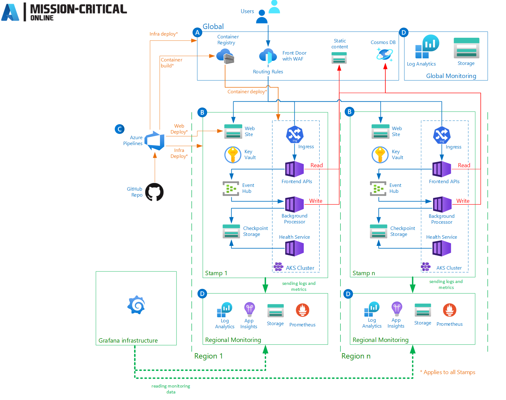

# Managed Prometheus in Azure Mission-critical

The Azure Mission-Critical reference implementation implements a wide variety of monitoring and observability capabilities and best practices. It uses regional and global Log Analytics workspaces to store logs and metrics, decoupled from the ephemeral nature and lifecycle of it's stamps, it contains an instrumented sample application workload using Application Insights for in-depth application metrics and distributed traces, uses a health service to evaluate and report the status of each of its deployed stamps and uses a self-hosted instance of Grafana to visualize the user and system flows and provide actionable insights into the overall health status of the workload. This is a good start, but might not be detailed enough for production workloads.

To further improve the observability capabilities of a mission-critical workload build based on top of a Azure Mission-Critical reference implementation, Prometheus can be used to gain more granular metrics from the infrastructure as well as from the workload.

> **Prometheus** is an open-source monitoring solution that enables you to collect metrics from various systems, applications, and services. It allows you to query and visualize your data, alert on critical conditions, and understand the performance and behavior of your infrastructure. It is built with a focus on scalability, reliability, and simplicity, making it a popular choice for monitoring large and complex systems.

## Why Prometheus?

Azure Mission-Critical follows a cloud-native-first, PaaS-first approach. Whenever possible should PaaS and cloud-native services be prioritized when designing, developing or modernizing a workload on Azure. These cloud-native, and several PaaS services have one thing in common, they provide prometheus metrics. To call out a few examples, AKS is using Kubernetes, Kubernetes provides Prometheus metrics on various levels like the control plane and the nodes (kubelet) but also its services like cert-manager, open service mesh and nginx (and of course many more) provide prometheus metric endpoints.

As the examples above show, Prometheus, Prometheus metrics and especially the Prometheus Query Language (PromQL) are well-established standards in the cloud native space. The existing Azure Monitor add-on for Azure Kubernetes Service already supported scraping prometheus metrics from endpoints within a cluster and stored them in Log Analytics. Azure Monitor Workspace now supports also PromQL which makes it easier to use across environments and platforms.

## Managed Prometheus

To use Prometheus you could already have deployed a Prometheus server on your own to scrape the metrics endpoints and provide the data to visualization tools like Grafana. But Prometheus is a beast by itself, you've to take care of the infrastructure, operations, maintenance and so on. This was now made easier with the availability of the **Azure Monitor managed service for Prometheus**. This managed service offering is compliant with the open-source project prometheus, but it abstracts the underlying infrastructure away. It consists of the following components:

- The 'ama-agent' is deployed on Kubernetes to gather the metrics.
- An **Azure Monitor workspace** where the collected data is stored.
- **Data collection rules** to determine what data to collect.
- **Data collection endpoints** define the target to sent the data to for analysis and storage.
- **Data collection rule associations** to link rules and resources they apply to.

This once set up provides you with a query endpoint that can be leveraged by for example Grafana to feed dashboards.

## How to fit Prometheus into Azure Mission-Critical?

You might wonder how these additional resources are getting deployed and where to put them. The answer is easy, the mission-critical architecture pattern separates between global and regional components as well as between stateful and stateless components.

The Azure Monitor workspace that stores the collected data is getting deployed into the `<prefix>-monitoring-rg`. One instance per region used.

The other resources, like the Data collection rule, endpoint and rule association is deployed alongside the regional stamps. They're ephemeral and share the same lifecycle as the stamp. When a new stamp is getting deployed, new rules, endpoints and associations are deployed and the old ones are getting destroyed.
See [Data considerations in Azure Monitor workspace overview](https://learn.microsoft.com/azure/azure-monitor/essentials/azure-monitor-workspace-overview#data-considerations) for more information.

## How to access the data?

The data can be visualized and queried via Grafana. The Azure Monitor workspace, deployed per-region, can be added as additional data sources to Grafana. When using the Grafana deployment in Azure Mission-Critical, the App Service instance used to host Grafana can be granted access to the Azure Monitor workspace via the built-in role "Monitoring Data Reader".  

---

[Azure Mission-Critical - Full List of Documentation](/docs/README.md)
