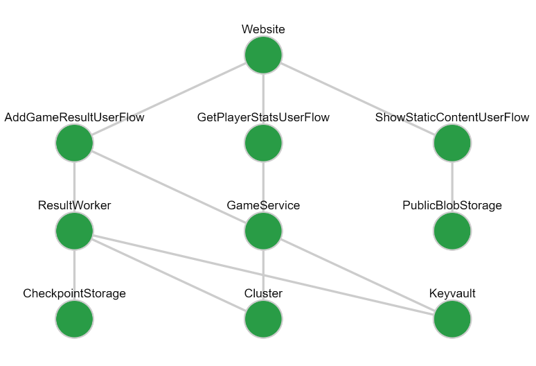
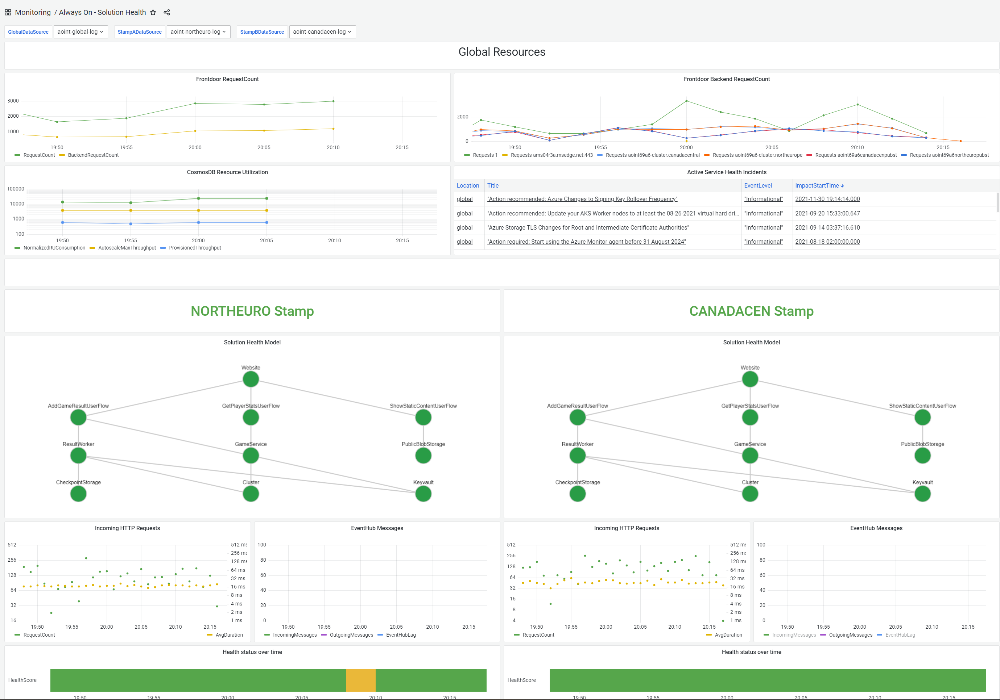
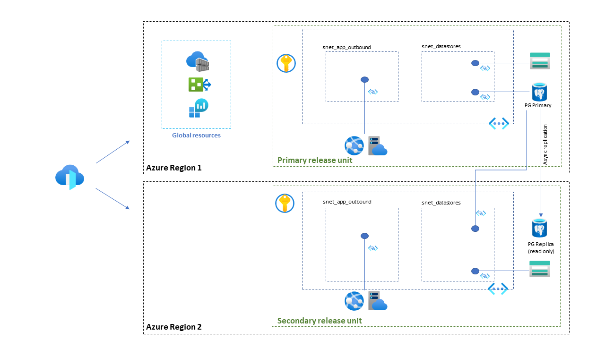

# Grafana

For the end-to-end deployment of the Grafana dashboards and the required infrastructure, there are several technical artifacts to be considered. This document describes them:
1. Grafana container containing the dashboards and the Health Model panel
2. Terraform templates used to deploy the infrastructure which hosts Grafana on Azure. 
3. Azure DevOps pipeline used to automate the deployment of the Terraform template.


# Grafana Container
This directory contains all the files needed for the automated provisioning of the Grafana monitoring solution. A screenshot of the full dashboard is shown at the bottom of this page. 

## Contents
When the Dockerfile is built, a container is created with the following:

- Grafana
- Solution Health Dashboards
- Azure Monitor data source
- AlwaysOn-Healthmodelpanel custom visualization

## Environment Variables
The container expects the following environment variables to be set:

| Name | Value   |
|------|---------|
| GRAFANA_USERNAME | Username for the Grafana instance |
| GRAFANA_PASSWORD | Password used with username |
| AZURE_DEFAULT_SUBSCRIPTION | Id of the Azure subscription that holds the Log Analytics instances |

## Managed Identity
The data source has been set for Managed Identity authentication to Azure.
This means that the infrastructure running the container, e.g. Azure App Service, should have its system-managed identity enabled and that identity should be assigned, at minimum, the 'Log Analytics Reader' permission on a scope that includes all required Log Analytics instances.

## Grafana Authentication
Currently, authentication has been set to a username/password. Obviously this is not the best way in production scenarios, but OAuth authentication requires external dependencies that make this reference implementation harder to deploy and may be subject to security constraints in your local environment. 

Before deploying this to your production environment, it is *highly recommended* to enable OAuth. This is done by editing the grafana.ini file and uncommenting/filling the values under the authentication section. Naturally, don't add secrets there. You can add ${MY_SECRET_VALUE} as a value and include that at runtime through environment variables. 

## Note about line endings
When editing on Windows, ensure that for the dashboard queries as well as the .ts and .tsx files, line endings are set to **LF** to ensure a smooth docker build process.

## Grafana Health Model Panel

The AlwaysOn health model has been implemented in Azure Log Analytics using KQL queries. This is a custom Grafana visualization panel, which can be used to visualize that health model. It's main purpose is to visualize, in an intuitive way:

- The health state of each component
- The hierarchical dependencies between components.


### Usage

#### Input Data

The panel depends on a Log Analytics query result that contains the relevant information. The following columns are required in the query result:

- **ComponentName** is the name of the component as it is displayed in the health model graph.
- **Dependencies** holds a comma-separated list of components that the specific component depends on. The names should match the 'ComponentName' value of the respective component.
- **HealthScore** is used to determine the color of the visualization. The values used here should match with the threshold values described in the panel options.

As an example, the query we use in the reference implementation is:

```kql
WebsiteHealthScore
| union ViewClaimUserFlowHealthScore
| union PostClaimUserFlowHealthScore
| union EventHubHealthScore
| union KeyvaultHealthScore
| union ClaimServiceHealthScore
| union ClaimWorkerHealthScore
| union ClusterHealthScore
```

This gives the following result, which is the input for the health model panel:

| ComponentName     | HealthScore | Dependencies                        |
| :---------------- | :---------- | :---------------------------------- |
| Website           | 1           | ViewClaimUserFlow,PostClaimUserFlow |
| ViewClaimUserFlow | 1           | ClaimService,Keyvault               |
| PostClaimUserFlow | 1           | Eventhub,ClaimWorker,Keyvault       |
| ClaimService      | 1           | Cluster                             |
| ClaimWorker       | 1           | Cluster                             |
| EventHub          | 1           |                                     |
| Keyvault          | 1           |                                     |
| Cluster           | 1           |                                     |

This query is subsequently visualized in the following way:


## Build & Deploy

### Option 1: Docker Build for the entire Grafana container

1. Docker build:
   `docker build -t alwayson-grafana .`

This docker container contains a full Grafana install as well as the healthmodel panel and can be run directly on any container hosting environment. The required environment variable for running unsigned panels has already been set.

### Option 2: Manually Build the healthmodel panel

1. Go to the _healthmodelpanel_ directory

2. Install packages:
   `yarn install`

3. Build the project:
   `yarn build`

4. Copy `./dist/*` to `/var/lib/grafana/plugins/healthmodelpanel` of your Grafana installation.

5. In order to run an unsigned Grafana panel, ensure that the following environment variable has been set:
   `GF_PLUGINS_ALLOW_LOADING_UNSIGNED_PLUGINS="alwayson-healthmodelpanel"`




# Terraform templates for deploying Grafana

## Overview

The reference deployment of Grafana is categorized into two parts - Global Resources and primary/secondary Release Units, following a similar pattern as the regular globally distributed workload. However, instead of active-active, the Grafana infrastructure follows an Active-Passive model. This is because the Grafana data is stored in a relational database (PostgreSQL), which does not support a multi-master model across regions. Consequently, the templates speak of the 'primary' and 'secondary' stamps or 'Release Units'.

Global Resources are services which are common to the primary and secondary release units. Release units are the services which make up the backend of Grafana application and database backend. For HA, reference deployment consists of one primary and one secondary release unit each.



The reference deployment consists of Grafana deployed as an App Service container. The state data is stored in an instance of Azure Database for PostgreSQL. For HA, a secondary instance of App Service is deployed in a separate region. However, this instance of App Service uses the primary instance of PostgreSQL for reads and writes. This design is taken from Grafana high-availability guidance published [here](https://grafana.com/docs/grafana/latest/administration/set-up-for-high-availability/). As per the guidance, multiple Grafana instances write to the same backend.

For HA of the backend Azure Database for PostgreSQL, we deploy one primary and one replica of the database. All read-write traffic goes to single primary instance of PostgreSQL. In case primary PostgreSQL is down, the read write traffic is diverted to the replica which then assumes role of primary.

There are 2 sets of Terraform templates categorized into `globalresources` and `releaseunits`.

Global resources are resources which are referenced by all the resources deployed in primary and secondary deployments i.e. Azure Front Door; Azure Container Registry; Log Analytics etc.

Release units are the resources required to support a highly available deployment of Grafana. The reference implementation deploys services across two stamps (primary and secondary).

From Terraform Workspace perspective, `globalresources` and `releaseunit` must have their individual separate workspaces. This improves maintainability of the project.

For the AppService instances in the primary and secondary regions, a Managed Identity is enabled. For these identities, the Terraform templates set the following role assignments in the Azure subscription: 
- The "ACR Pull" role on the container registry in the global resources resource group. This is needed to download the docker container upon AppService startup. 
- "Log Analytics Reader" on the subscription. This ensures that all Log Analytics instances can be used as a data source for the dashboards. 

## Pre-requisites  

- The role used for running Terraform templates must have `owner` access to the subscriptions. Contributor permissions are insufficient because role assignments are deployed. 

## FAQ about Terraform templates

- Why separate code block for deploying PostgreSQL database primary and secondary instances and not use Terraform `for_each` meta-argument instead?  

    In `./releaseunit/postgresql.tf`, you'll observe two separate instances of `azurerm_postgresql_server` one each for deploying primary and secondary instances of PostgreSQL databases on Azure. For_each deploys resources in parallel and to deploy a replica (secondary) PostgreSQL database, primary must be online before deployment of replica (or secondary) can commence. Secondly, Terraform does not allow `self` reference so one cannot set the value of parameter `creation_source_server_id` and reference primary under the same block while using for_each meta argument.

- How long does it take to deploy all the resources defined in the templates?

  90th percentile for end-to-end deployment (including global and releaseunits) is < 30 mins. Some deployments have known to taken ~ 45 mins.

## Deploying global resources for Grafana

The following resources are considered 'global', since they are referenced by both the primary and secondary stamp:

- Azure Front Door
- Azure Container Registry
- Log Analytics Workspace

## Deploying primary and secondary stamps for Grafana

Templates for release units are stored in `./releaseunit` directory. The templates are configured to deploy 2 x Grafana instances and all associated resources in a highly available fashion. The input parameter you must provide is `prefix`. Ideally, this should be the same as one used for global resources. Whilst it won't break the deployment, however to keep things consistent, we recommend using the same prefix across global and release unit deployments.

`terraform.tfvars` contains default values. As a minimum requirement, you need to provide the following input values:

1. `prefix` - this is a up to 10 character long string.  
2. `stamps` - these are the regions where you wish to deploy primary and secondary release units. `stamps` is a map which contains name of the regions, VNet address spaces etc. which are to be deployed inside a primary and secondary regions. Example of a stamp is shown here: 

```stamps = {
  "primary" = {
    location           = "eastus"
    vnet_address_space = "10.1.0.0/16"
    snet_app_outbound  = "10.1.1.0/24"
    snet_pgdb          = "10.1.2.0/24"
    akv_flag           = true
    db_primary         = true
    db_replica         = false
    db_create_mode     = "default"
  }
  "secondary" = {
    location           = "eastus2"
    vnet_address_space = "10.2.0.0/16"
    snet_app_outbound  = "10.2.1.0/24"
    snet_pgdb          = "10.2.2.0/24"
    akv_flag           = false
    db_primary         = false
    db_replica         = true
    db_create_mode     = "replica"
  }
}
```

***Note -*** `./releaseunit/terraform.tfvars` contains several pre-defined variables for Azure Storage and Azure Database for PostgreSQL. These allow you to change features such as size etc. of a service. You can leave these as is unless you want to go with a different size.

## Pipeline Design

The automation pipeline is a multi-step process. It was developed in a way that maximizes re-use of the deployment artifacts from the regular end-to-end workload deployment.

- Step 1 - deploy resources defined under `./globalresources` directory. You must configure/add backend details if already known upfront.

- Step 2 - Build the docker container for Grafana and push it to the Azure Container Registry that is part of the global resources. 

- Step 2 - Deploy the regional stamps. To do this, the frontdoor header id and the full container name with tags are passed from the global deployment output.
