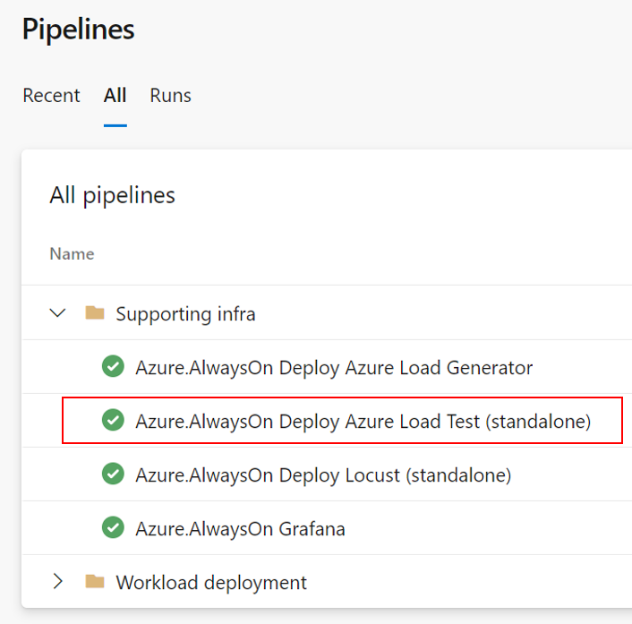
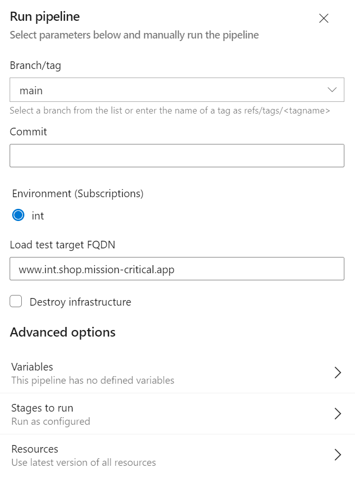
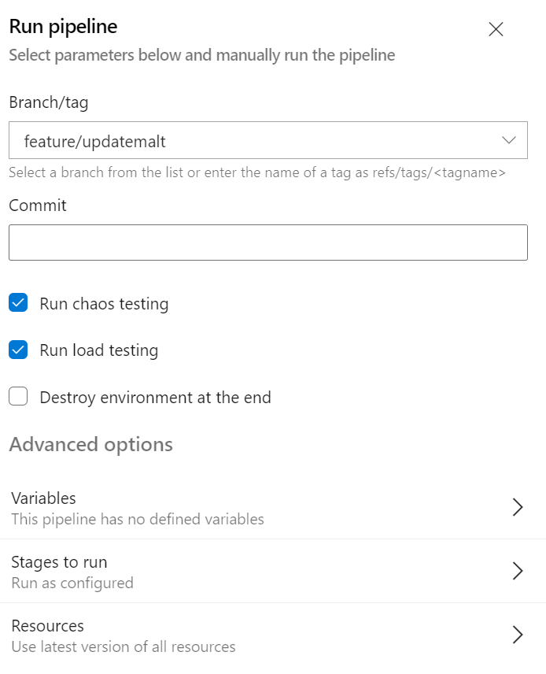
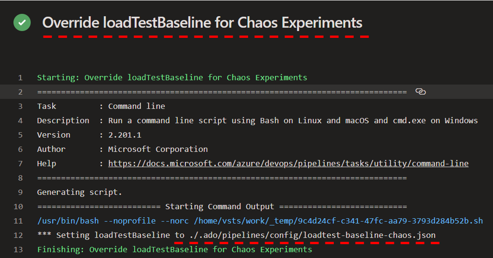
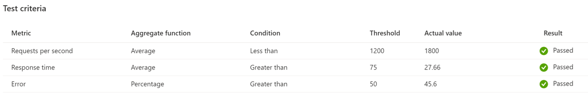

# Load testing with Azure Load Test Service (MALT)

Azure Mission-Critical uses the Microsoft Azure Load Test Service (MALT) for load testing. MALT is a Apache JMeter-based managed service and is implemented as a standalone as well as as a pipeline-embedded solution in Azure Mission-Critical.

The **Azure.AlwaysOn Deploy Azure Load Test (standalone)** pipeline creates the Load test resource in Azure, creates a test and uploads the JMeter load test definition created and optimized for the Azure Mission-Critical sample application and its APIs.

The load test target FQDN can be either specified at pipeline runtime or later by modifying the test definition via Azure Portal:

The embedded implementation is part of the end-to-end (e2e) pipeline and can be easily leveraged by checking the "Run load test" checkbox.

## Implementation

MALT in Azure Mission-Critical is deployed via Terraform, PowerShell and Azure Pipelines, the `/.ado/pipelines/templates` directory contains a template called `stages-loadtest-azure.yaml` which is used with different parameters for the standalone deployment as well as for the e2e embedded deployment. The Load Test service is deployed via Terraform stored in `/src/testing/loadtest-azure/infra` and the test creation, configuration and execution is done via the MALT API wrapped into PowerShell scripts stored in `/src/testing/loadtest-azure/scripts`.

## Baseline / Test criteria

MALT provides native support to define test criteria for each load test. Azure Mission-Critical leverages this functionality by using different baseline definitions for regular e2e runs as well as for e2e runs with chaos testing enabled. A regular e2e run with load testing enabled uses the test criteria specified in `loadtest-baseline-normal.json` in `/.ado/pipelines/config` for e2e runs with chaos enabled `loadtest-baseline-chaos.json` is used which accepts a higher error rate.

The baseline definition files can be either modified directly or replaced by changing the path in `/.ado/pipelines/config/configuration`. The regular baseline is specified in `azureLoadTestBaseline` the chaos-specific baseline in `chaosLoadTestBaseline`.

---

[Back to documentation root](/docs/README.md)
